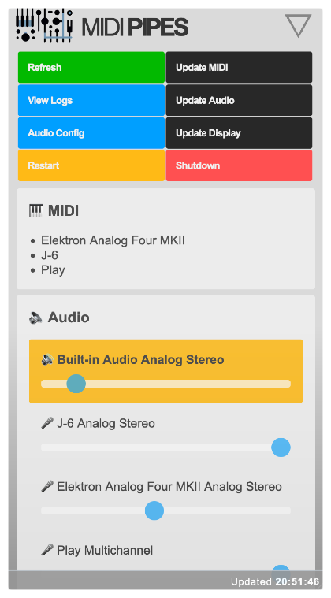

# MIDI Pipes

**MIDI Pipes** links USB MIDI devices together and routes audio to an output automatically.

Installed on something like a Raspberry Pi you can use **MIDI Pipes** as a standalone device, linking all your USB / Bluetooth MIDI and audio kit together. You don't need to plug in any monitors, (typing) keyboards, mice, etc. It'll just do it all automatically.

**MIDI Pipes** can work as a black box but it also supports displays to show current status and if connected to a network a web interface is available to see status and manage functions.

In other words, you don't need a "full computer", just this little box.

### Why?

I didn't want to have a full computer, screen, etc., involved in my audio / MIDI / modular sound playtime.
There was a Raspberry Pi and a few accessories lying round, so I built this.

### Installation

Installation should work on pretty much anything, these are the steps I use for a Raspberry Pi:

1. Install fresh version of Raspberry OS to a microSD card (Lite, 64bit recommended).
2. Boot and log into terminal (direct or SSH, etc).
3. Clone repo or download and extract archive.
4. Run installer: `cd midipipes; sudo bash install.sh`

### Usage

Plug in MIDI USB or connect MIDI Bluetooth devices to link their MIDI interfaces together.

You can also plug in audio devices, sound will be routed to the output (e.g. Raspberry Pi headphones jack). e.g. Any MIDI devices that also provide USB audio will have that routed to the output too.

### Display

If an Inky wHAT display is connected it will show the status and a QR-code you can scan (e.g. with your phone) to access the web interface.

### Web

A simple mobile-friendly web interface provides:

* Connected device names
* Mixer (volume adjustments for each device)
* Audio output selectors
* Logs, update screens, restart, shutdown, etc...

Scan the QR code on the display to access it.

Alternatively visit it's IP address manually from a web browser (e.g. http://192.168.0.123). If you configured a hostname and your network supports it, you can also access it via the hostname (e.g. http://midi.local).

### Updating

**MIDI Pipes** sets the filesystem to read-only for speed (keeping everything in memory) and to save wear and tear on SD cards.

You can switch between read-only and read-write modes (e.g. to make further updates to your installation):

`cd midipipes; sudo bash fs.sh`

You will be asked if you want to switch between read-only or read-write, your system will then be rebooted to implement the change.

### Temporary files

Logs and runtime files are created in `/tmp` as text files named in the format `midi-*.txt`. So if there's a problem check the log file (can also be accessed via the web interface). Bear in mind a reboot will remove those files _(read-only filesystem by default, also *nix will nuke `/tmp` directory on boot by default)_.

### Want one as a device?

Want a nice finished product in a proper box and everything pre-installed?
Get in touch and if there's enough demand I'll consider a 3D print run! :)
